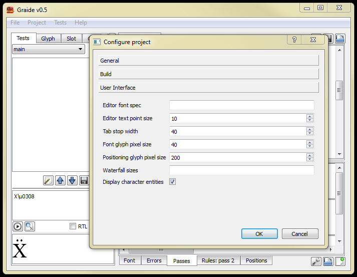

{: .tut-nav-bar }
|  [&#x25C0; Unit 10: Positioning by shifting](graide_tutorial10) | [&#x25B2; Contents](../graide_tutorial#contents) | [Unit 12: Positioning by attachment &#x25B6;](graide_tutorial12) |

# Unit 11: Glyph metrics

[Exercises](graide_tutorial11#exercise-11)

## Discussion

To position glyphs correctly, it is often necessary to make use of the glyph’s metrics from within the font. Glyph metrics are numeric values for standard measurements defined for each glyph within the TrueType font. The following metrics can be used in a GDL program:

* `boundingbox.top` (`bb.top`)
* `boundingbox.bottom` (`bb.bottom`)
* `boundingbox.right` (`bb.right`)
* `boundingbox.left` (`bb.left`)
* `boundingbox.height` (`bb.height`)
* `boundingbox.width` (`bb.width`)
* `advanceheight` (`ah`)
* `advancewidth` (`aw`)
* `leftsidebearing` (`lsb`)
* `rightsidebearing` (`rsb`)
* `ascent`
* `descent`

Useful abbreviations (as defined in **stddef.gdh**) are shown in parenthesis. Note that `ascent` and `descent` are not metrics of an individual glyph but of the font as a whole.

## Exercise 11

Use shifting and/or kerning to position diacritics over lowercase vowels. The diacritics should be attached to the previous base character. Here are some diacritics to include:

* grave -  U+0300 (glyph #250)
* acute -  U+0301 (glyph #247)
* circumflex -  U+0302 (glyph #253)
* tilde -  U+0303 (glyph #267)
* macron -  U+0304 (glyph #281)
* diaeresis -  U+0308 (glyph #290)
* hacek -  U+030C (glyph #264)

What is required to position them correctly over base characters of widely different widths and heights (eg, m vs. l)?

What is necessary to handle diacritics that have overstriking built in to their glyph metrics?

What is necessary to render i and j correctly with diacritics? (Hint: other glyphs you may find useful include: dotless i [glyphid 194] and dotless j [glyphid 195]).

Hint: instead of including numbers directly in the rules, define glyph attributes indicating the amounts by which to shift. You may also need to define a glyph attribute on the base characters as well as the diacritics being positioned. To access glyph attributes for a slot in the rule other than the one being shifted, use the following syntax:

```
@slot-number.glyph-attr
```

[Solution](graphite_tut_solutions#exercise-11)

### Exploring Graide: non-ASCII text data

If you do not have a keyboard installed that allows you to conveniently type diacritics or other non-ASCII characters, you can enter them into your Graide test data using Unicode codepoints. The syntax is

```
\u<USV>
```

For instance, to enter X + diaeresis, type the following as test data: `X\u0308`. (Do not leave any space after the X.)

If you prefer to always see the Unicode codepoints for non-ASCII data, there is a flag in the Configuration properties dialog to indicate this. Open the section called **User Interface** and check the box labeled **Display character entities**.

{: .image-tight }


<figcaption>Entering non-ASCII text data</figcaption>

### Exploring Graide: Glyph and Slot tabs revisited

Run the following data: `m\u0304 I\u0304`. Use the Glyph tab to compare the values of the glyph attributes for m and I. Use the Slot tab to compare the amounts by which the diacritic was shifted.
