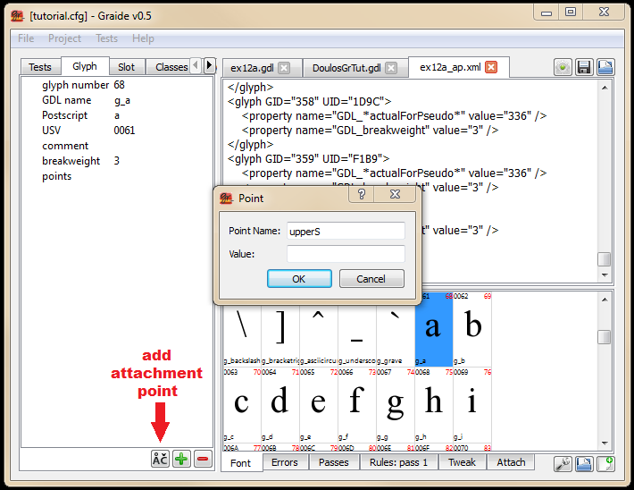
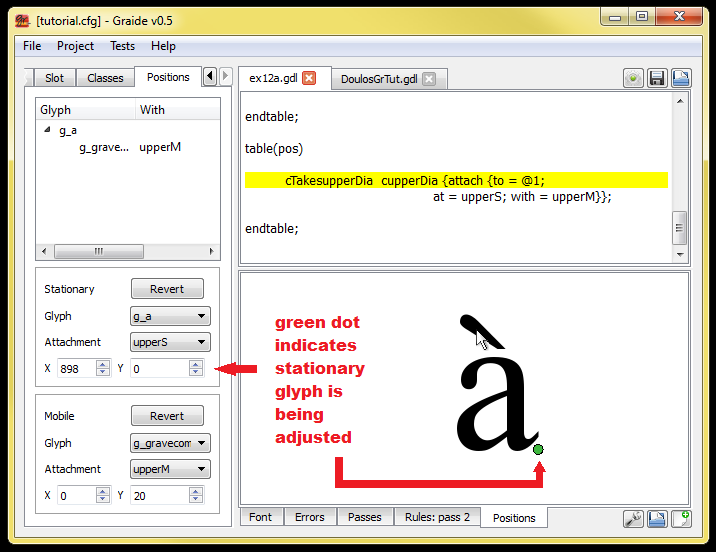
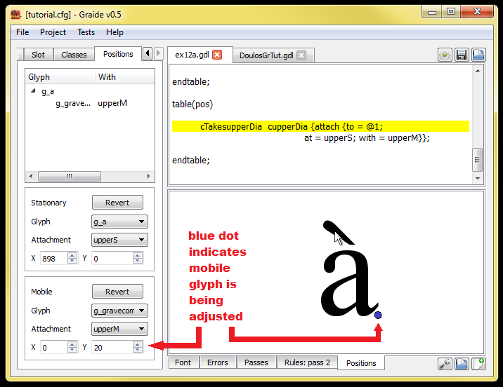

{: .nav-table }
|  [&#x25C0; Unit 11: Glyph metrics](graide_tutorial11) | [&#x25B2; Contents](../graide_tutorial#contents) | [Unit 13: Features &#x25B6;](graide_tutorial13) |

# Unit 12: Positioning by attachment

[Exercises](graide_tutorial12#exercise-12a)

## Discussion

Use of attachment points can be a more elegant way to accomplish positioning than shifting and kerning. With this approach, attachment points are defined on glyphs using glyph attributes. Then there are rules that attach glyphs at their attachment points when they occur within a given context. When two glyphs are attached, they are positioned so that their attachment points exactly coincide.

[](../assets/images/attachmentPoints.png)

For instance, the following statement defines an attachment point at the upper center of a base character, where you might want to attach a diacritic:

```
clsBase = <glyph-list>
    { upperAttPtS = point(bb.width/2, bb.top) };
```

A second statement defines a corresponding attachment point at the bottom of the diacritic:

```
clsDiac = <glyph-list>
    { upperAttPtM = point(bb.width/2, bb.bottom) };
```

Notice that attachment points generally come in pairs, and so it is helpful to give them corresponding names. A helpful convention that is particularly recommended if you are using Graide is to use an S for the point on the base, meaning “stationary” - i.e., the base is stationary with respect to the diacritic. Similarly, M can be used on the diacritic to indicate that it is “mobile” with respect to the base.

A rule within the positioning table is used to perform the attachment, as shown:

```
table(pos)
  clsBase  clsDiac {attach {to=@1; at=upperAttPtS; with=upperAttPtM}};
endtable;
```

This rule has the effect of attaching the diacritic (the mobile glyph). The `attach.to` slot attribute indicates the neighboring (stationary) item to which it should be attached, that is, the base character. The `attach.at` attribute names the glyph attribute which is the relevant attachment point on the base character, and `attach.with` indicates the corresponding attachment point on the diacritic. (Remember that `{attach {to=@1; ... }}` is equivalent to `{attach.to = @1; ... }`.)

## Exercise 12a

Rewrite your program from Exercise 11 to position the diacritics using attachment points.

[Solution](graphite_tut_solutions#exercise-12a)

### Exploring Graide: using _makegdl_ and the attachment point editor

Graide includes a visual attachment point editor. It allows you to see glyphs to be attached on the screen and move them around to achieve the best positions for the attachment points.

Graide creates an XML file to store the point values. (This kind of file could also be generated by other software such as FontLab.) This file is then used to autogenerate a GDL file containing the attachment point glyph attributes. In fact, the process that generates the GDL, called _makegdl_, will generate other GDL source code, including glyph definitions for all the glyphs in your font, and classes based on Postscript names.

To use this mechanism, you must do the following.

**Step 1.** _Set up your configuration appropriately._ Go into the configuration dialog and choose the **Build** section. Enter a name for your attachment point file, eg, ex12a_ap.xml. Notice that the name of an autogenerated GDL file is supplied for you, based on the name of the font. Set the "Attachment positioning pass" to None (click the down arrow on the spin control). Click OK.

Start with a new GDL file, or remove any existing positioning rules. Click the gear icon to build the project. (If your GDL file is empty, there will be one warning in the Errors pane.) A file called **DoulosGrTut.gdl** has been created; open that file in your code pane. You’ll notice there are definitions provided for all the glyphs in the font, based on the Postscript names. Toward the bottom of the file are some classes. There is a section called “Point Classes” which is currently empty, but eventually will contain groups of classes that have certain attachment points defined.

The very last line of the file looks something like this:

```
#include "C:\SomePath\MyWorkspace\mytutorialfile.gdl"
```

When Graide is set up to use _makegdl_, instead of compiling your GDL file directly, the autogenerated file is compiled which in turn includes your GDL file.

Another file that has been created is the **ex12a_ap.xml** file; open it in Graide. You’ll see a sequence of glyphs with various information, but no attachment points—yet.

**Step 2.** _Define some attachment points._ Click on the Font tab and find the lowercase ‘a’. Double click on it, and the Glyph tab will appear displaying the glyph. Click on the “add attachment point” button at the bottom of the pane.



We are going to define an upper attachment point. So give the new point the name “upperS”. (‘S’ stands for “stationary”, meaning that the base glyph is stationary with respect to the diacritic.) You can enter an initial value of “(0,0)”, or leave the Value field blank, in which case it will default to zeros. Click OK.

Build the font again. Search in the **DoulosGrTut.gdl** file for “upperS”. You should find it now defined as a glyph attribute of “g_a”.

Return to the Font tab and find the grave accent (U+0300, glyph #250, with a Postscript name of "gravecomb" - make sure this is NOT the backquote glyph!). Double click on it. Add an attachment point to it in the same way, giving it the name “upperM”. (‘M’ indicates that the diacritic is “mobile” with respect to the base character.) If you rebuild the font and search for “upperM”, you should find it defined on the combining grave, “g_gravecomb”.

Note: while the Graphite engine and compiler do not make any assumptions about the names of attachment points, Graide will work best if you use pairs of attributes with the forms “xxxS” and “xxxM”.

Now let’s look more closely at the classes in **DoulosGrTut.gdl**. If you look in the section labeled “Point Classes” you will see a number of classes present, based on the two attachment points we defined. Notice that there are two classes called “cupperDia” and “cTakesupperDia” that contain the grave and the ‘a’, respectively. These can be used for writing a rule to perform the upper-diacritic attachment.

There are also classes called “cnupperDia” and “cnTakesupperDia”. These contain glyphs that do not handle the upper attachment point. These can be used for more complex attachment rules.

**Step 3.** _Write the attachment rule in the positioning table._ Your program should look something like:

```
#include "stddef.gdh"
table(pos)
pass(1)

  cTakesupperDia  cupperDia {attach {to = @1;
                    at = upperS; with = upperM}};
endpass;
endtable;
```

(Because Graphite automatically creates a default positioning pass, the positioning table is considered "multi-pass", so you'll need to include the `pass(1)...endpass;` statements.)

Build your program and run the following test data: `a\u0300`. By looking in the Rules tab, you should see that the attachment rule is fired, but the results probably don’t look very good. This is because the attachment points need to be adjusted. That’s the next step.

**Step 4.** _Set attachment points visually._ Click on the Attach tab in the left-hand pane. What we are going to do is to create a tree-like structure the represents a cluster of bases and diacritics that attach to them. The root of the tree represents the base, and the leaves are the diacritics. Right-click in the empty space in the pane and choose **Insert Simple Cluster…**. Choose the “upper” attachment point. The other controls are filled in with the glyphs that define this pair of points (only one each so far). Click OK.


Notice that a tree structure has appeared, and the Attach tab in the lower pane now displays the two glyphs, ‘a’ and the grave combining mark. Drag the grave to an appropriate position on top of the a glyph. As you hold down the mouse, a green dot appears—the green dot means that you are adjusting the attachment point on the stationary glyph—upperS. The X/Y coordinates of the point are shown in the left-hand column; notice that they change as you drag the grave.



Another way to adjust the positioning is to change the coordinates of the grave itself—the upperM attachment point. Hold down the SHIFT key and drag the grave again. A blue dot appears to indicate it is the mobile glyph that is being adjusted. Notice that the X/Y coordinates of the grave are changing, but the coordinates of the ‘a’ are unchanged.



You may be wondering about the choice between adjusting the stationary glyph as opposed to the mobile glyph. Keep in mind that when you adjust the coordinates of the base glyph, you are adjusting how all diacritics that use the set of “upper” attachment points will attach to that base. Similarly, when you adjust the coordinates of the diacritic, you are adjusting how that glyph will attach to all bases. So it is important to carefully consider which kind of adjustment you want to make.

Rebuild the font and rerun your test data. The end result should look a lot like the glyphs you positioned by hand!

**Step 5.** _Add attachment points to two more glyphs._ Using the Glyph tab, try adding an upperS attachment point to the ‘e’ glyph and an upperM attachment point to the circumflex (U+0302, glyph #253). When you return to the Attach tab, the Glyph controls at the bottom of the left-hand pane now offer “g_e” and “g0302”. Adjust the positions of the two new glyphs. Notice that you can use the spin controls in the lower-left-hand dialogs as well as dragging the glyphs.

Experiment with the effect of adjusting the stationary points as opposed to the mobile points.

**Step 6.** _Add attachment points to the remaining glyphs._ Notice that you can hover over the Glyph dropdown controls and use the scroll wheel on the mouse to quickly cycle through all the glyphs of interest.

Hint: it may be helpful to set the attachment points on the stationary glyphs first, using a symmetrical glyph such as the circumflex, and then set the mobile points using a symmetrical base such as ‘i’.

Define the “upperS” points for dotless-i and dotless-j, and include the substitution rule that removes the dot (from Exercise 11). You can use the cupperDia class to test for the presence of an upper diacritic.

Remember to rebuild your font in order to test the results!

## Exercise 12b

Write a program to position the following lower diacritics using attachment points.

* grave below -  U+0316 (glyph #249)
* acute below -  U+0317 (glyph #246)
* plus sign below-  U+031F (glyph #310)
* diaeresis below-  U+0324 (glyph #289)
* ring below -  U+0325 (glyph #298)
* vertical line below -  U+0329 (glyph #306)
* tilde below -  U+0330 (glyph #265)

[Solution](graphite_tut_solutions#exercise-12b)

### Exploring Graide: reinitializing the visual attachment point editor

If you already have a cluster present in the Attach tab, right-click and choose **Delete All** to clear those glyphs. Then choose **Insert Simple Cluster** and choose the new lower attachment point.

## Exercise 12c

Write a program to position the Greek lower iota diacritic (“ypogegrammeni,”  U+037A) correctly under the Greek vowels alpha (U+03B1), eta (U+03B7), and omega (U+03C9). Note that when attached to the eta, the diacritic is not centered but is positioned under the left-hand stroke, as shown:


Compile your program against the Galatia Graphite Tutorial font (**GalatiaGrTut.ttf**).

Extend your program to handle a possible intervening upper diacritic (eg, smooth breathing mark, &#x0313; U+0313 or rough breathing mark, &#x0314; U+0314) between the base character and the lower diacritic.

[Solution](graphite_tut_solutions#exercise-12c)
