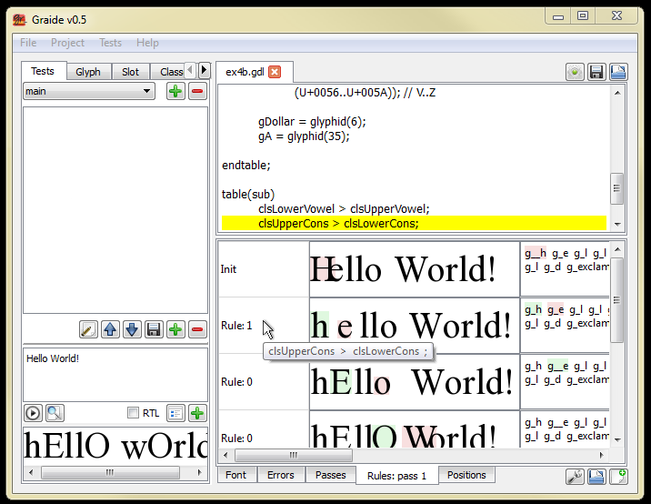

{: .nav-table }
| [&#x25C0; Unit 3: The glyph table](graide_tutorial3) | [&#x25B2; Contents](../graide_tutorial#contents) | [Unit 5: Deletion and insertion &#x25B6;](graide_tutorial5) |

# Unit 4: Corresponding class items

[Exercises](graide_tutorial4#exercise-4a)

## Discussion

So far the right-hand (output) side of our GDL rules have contained single glyphs. It is also possible to use a multi-glyph class for substititution.

When one glyph is substituted for another, the Graphite engine determines the position of the input glyph within the input class, and uses the corresponding item from the output class in the substitution. For instance, the following two classes define classes of uppercase and lowercase letters:

```
table(glyph);
  clsUppercase = unicode(65..90);   // A .. Z
  clsLowercase = unicode(97..122);  // a .. z
endtable;

table(sub);
  clsUppercase > clsLowercase;
endtable;
```

When, say, the uppercase “H” is encountered in the input, the corresponding lowercase “h” is placed into the output. Keep in mind that the order of the items in the classes becomes very significant when this mechanism is being used.

Note that you need to use parenthesis around the members of a class when there are more than one. For instance:

```
clsConsVoiced = (gB, gD, gG);
clsConsVoiceless = (gP, gT, gK);
```

## Exercise 4a

Write a program to capitalize all text.

[Solution](graphite_tut_solutions#exercise-4a)

## Exercise 4b

Write a program to make all vowels uppercase and all consonants lowercase.

[Solution](graphite_tut_solutions#exercise-4b)

### Exploring Graide: the Rules tab with multiple rules

The program you wrote for Exercise 4b should have at least two rules in it. Enter some test data: Hello World! The output should look like: **hEllO wOrld!** Double-click on Pass 1 in the Passes pane. Notice that both Rule 0 and Rule 1 appear in the Rules pane. Clicking on the box in the left-hand column should highlight the appropriate rule in the code pane.

Also notice that hovering over the left-hand cell containing the rule number will cause the rule to be displayed near the cursor.



## Exercise 4c

Write a program to create a Greek transliteration of Roman text, using the mappings in the table below. (You may ignore uppercase for this exercise.) Note that the Unicode codepoints are not in strict numerical order, and that there are no mappings for the letters j and v.

|Roman letter|Greek letter|Glyph|Unicode (hex)|
|:-----------|:-----------|:----|:------------|
|a|alpha|{usv:03B1 glyph}|03B1|
|b|beta|{usv:03B2 glyph}|03B2|
|c|chi|{usv:03C7 glyph}|03C7|
|d|delta|{usv:03B4 glyph}|03B4|
|e|epsilon|{usv:03B5 glyph}|03B5|
|f|phi|{usv:03C6 glyph}|03C6|
|g|gamma|{usv:03B3 glyph}|03B3|
|h|eta|{usv:03B7 glyph}|03B7|
|i|iota|{usv:03B9 glyph}|03B9|
|k|kappa|{usv:03BA glyph}|03BA|
|l|lambda|{usv:03BB glyph}|03BB|
|m|mu|{usv:03BC glyph}|03BC|
|n|nu|{usv:03BD glyph}|03BD|
|o|omicron|{usv:03BF glyph}|03BF|
|p|pi|{usv:03C0 glyph}|03C0|
|q|theta|{usv:03B8 glyph}|03B8|
|r|rho|{usv:03C1 glyph}|03C1|
|s|sigma|{usv:03C3 glyph}|03C3|
|t|tau|{usv:03C4 glyph}|03C4|
|u|upsilon|{usv:03C5 glyph}|03C5|
|w|omega|{usv:03C9 glyph}|03C9|
|x|xi|{usv:03BE glyph}|03BE|
|y|psi|{usv:03C8 glyph}|03C8|
|z|zeta|{usv:03B6 glyph}|03B6|

Compile your program against the Galatia Graphite Tutorial font (**GalatiaGrTut.ttf**) that is provided with the tutorial materials. It is best to copy the font into your workspace.

{: .blue-note }
> **Note**
>
> If you use lowercase in the hexadecimal numbers representing your Unicode codepoints, you may see a compilation error: "Undefined glyph class: oundingbox". This a bug in the pre-processor, where it interprets the hex digits 'bb' as 'boundingbox'. The work-around is to use 'BB' in instead of 'bb'.

[Solution](graphite_tut_solutions#exercise-4c)

<< Back: [Unit1: Using Graide](graide_tutorial1) | [Introduction and Contents](../graide_tutorial) | Next: [Unit3: A very simple GDL program](graide_tutorial3) >>